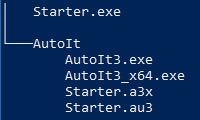
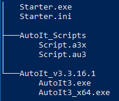
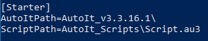

# AutoIt3 Script Starter

The problem is described in the article [AutoIt and Malware](https://www.autoitscript.com/wiki/AutoIt_and_Malware).

Use the AutoIt3-Script-Starter to avoid false virus positives.

#
### Usage Option 1

Folder tree

AutoIt and script files should be located in a folder named AutoIt.

The Starter-file and the Script-file must have the same name (any name).

#
### Usage Option 2

Folder tree

Starter.ini

The Starter-file and the INI-file must have the same name (any name).

If the folder path is specified, a trailing backslash is required.

#
### Priorities 

64-bit-Starter will prefer AutoIt3_x64.exe, unless otherwise specified in the INI file. 

Starter will prefer compiled .a3x, unless otherwise specified in the INI file.

#
### Download 

[AutoIt3 Script Starter v1.0](https://github.com/coderemaster/AutoIt3-Script-Starter/releases/tag/Starter_v1.0)
